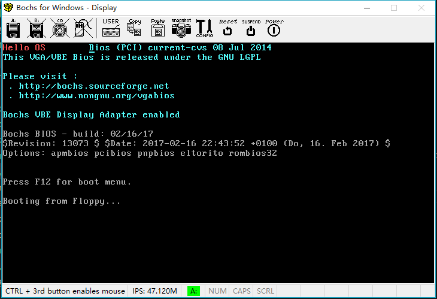

# Bochs Hello World

## 环境

Windows 10 x64

要在Linux下运行需要在`bochsrc`下增加

`display_library: sdl`

## 编译到二进制

`nasm boot.asm -o boot.bin`

## 写入软盘映像

`dd if=boot.bin of=a.img bs=512 count=1 conv=notrunc`

## 执行

`bochs -f bochsrc`