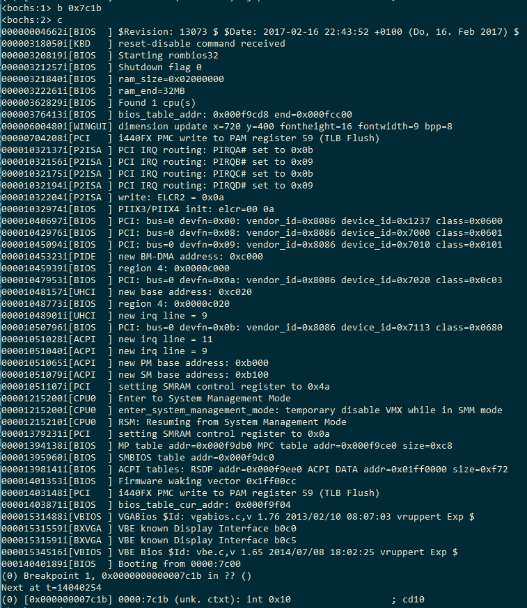
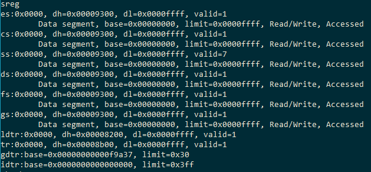
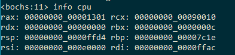

# 代码阅读

## 为什么`mov bp, ax`后，`int 10h`就能够取到BootMessage的地址了？

### 答案

因为这个指令之后，es:bp的值就是"Hello OS"字符串的首地址。

### 过程

16号中断是用来触发一个关于视频服务的功能的。当功能号是0x13时，打印字符串，es:bp是字符串地址。

`mov bp, ax`上一句是`mov ax, BootMessage`，即ax:=BootMessage，即字符串首地址。`mov bp, ax`只是把字符串首地址赋值给bp而已。

而es在函数调用之前被赋值成了CS就是段首地址。

这样，es:bp就是BootMessage所在的实际地址。16号中断里就可以这样找到实际的BootMessage地址了。

https://zh.wikipedia.org/wiki/INT_10H

## 运行到这行代码的时候ax里面的值是多少？

### 答案

0x7c1e

### 过程

由`ndisasm -o 0x7c00 boot.bin >> disboot.asm`得到反汇编代码`disboot.asm`。

在`./disboot.asm`地址00007C0B处，指令为`mov ax, 0x7c1e`，即将立即数0x7c1e mov给了ax。过于明显不需要实机验证。

## 这个值是不是BootMessage所在内存中的位置（即相对地址还是绝对地址）？

### 答案

在此例中是其所在内存中的位置。

### 过程

讲道理，此时bp只是相对地址，相对地址需要加上段地址才是实际地址，但是在此例中，计算机刚启动，所有段寄存器都是0，所以bp的值就是其字符串的绝对地址。

使用`bochsdbg`工具进行单步调试，在执行`int 10h`前（0x7C1B）设置断点，查看寄存器值和物理内存0x7c1e位置的值。

设置断点并执行到`int 10h`

所有段寄存器的值都是0，当然包括es。

bp的值是7c1e。bp即rbp的低8位。

所以es:bp的值就是0x7c1e，也就是10h中断所认为的字符串的位置。

物理地址0x7c1e的值如下，以char格式打出9个字节，可以看到就是Hello OS。

