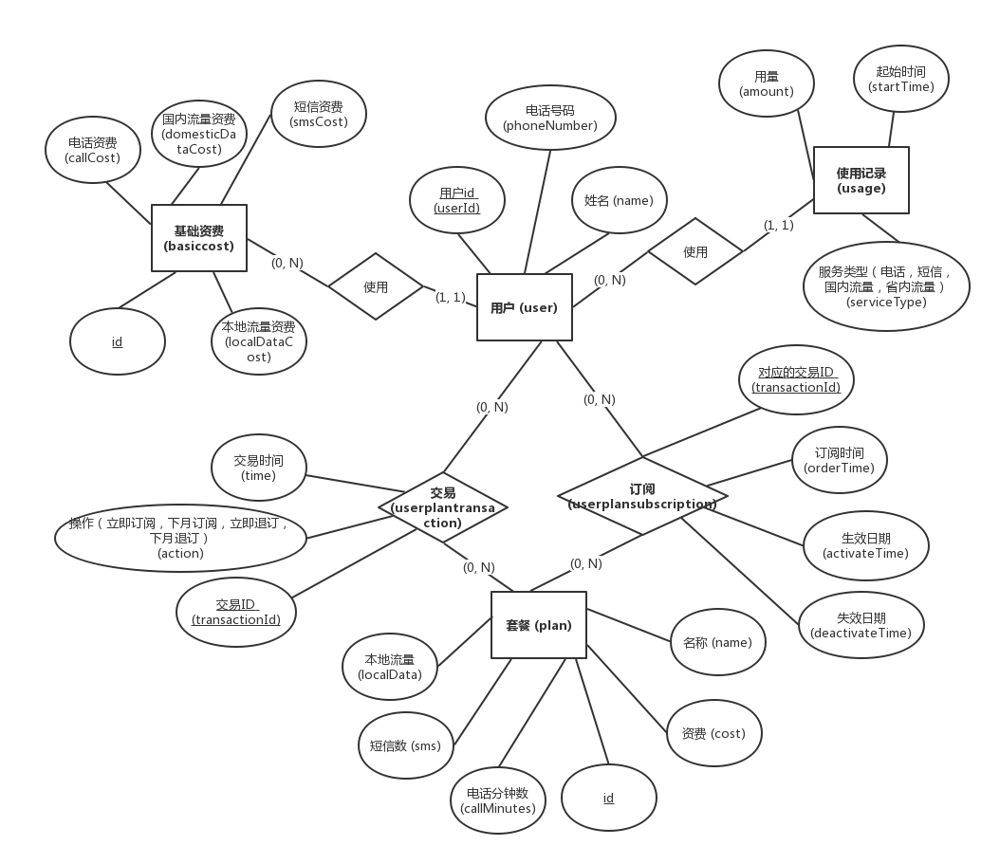
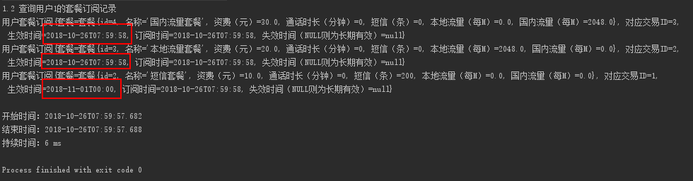
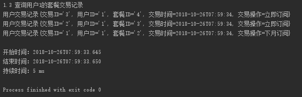

# 说明文档

# 1. 环境说明

## 1.1 环境说明

| 环境 | 版本号 |
| -- | -- |
| 编程语言 | Java 8 |
| 持久层框架 | MyBatis 3.4.6 |
| 数据库 | MySQL 5.7 |
| 操作系统 | Windows 10 17763 x64 |
| IDE | Intellij IDEA |


## 1.2 数据库环境说明

| 项 | 值 | 
| -- | -- | 
| 数据库环境和版本 | MySQL 5.7 | 
| 编码 | UTF-8 |
| Driver | mysql-connector-java 5.1.46 |
| 地址 | localhost:3306 |
| 数据库名（schema名）| carrier | 
| 用户名 | root | 
| 密码 | zhanglingzhe0820 |

数据库密码中出现了另一个同学的名字，是因为本机的MySQL是大二下软工2的时候设置的，当时为了减少配置的麻烦，就约定了在每个人的电脑上都使用相同的用户名和密码。

# 2. 数据库表设计和ER图

## 2.1 ER图

By processOn



## 2.2 各个表的含义

| 表 | 表名 | 含义 |
| -- | -- | -- |
| 用户 | user | 保存用户信息 |
| 基础资费 | basiccost | 保存可用的基础资费。一个用户必定有一个基础资费 |
| 套餐 | plan | 保存可用的套餐 |
| 订阅 | userplansubscription | 保存用户订阅的套餐情况。用户订阅一个套餐，会在订阅里增加一条记录；每次退订会设置对应的订阅的失效时间。 |
| 交易记录 | userplantransaction | 保存用户的交易信息。每次订阅、退订都会在交易记录里增加一条记录，保存用户ID、套餐ID、交易时间和交易行为（立即订阅，立即退订，下月订阅，下月退订） |
| 使用情况 | usage | 保存用户对电话、短信和流量的使用情况。所有使用情况均保存在这一个表中。 |

## 2.3 各个表列的含义

表：用户 (user)

| 列 | 类型 | 含义 |
| -- | -- |
| id | int primary key auto_increment | ID |
| name | varchar(30) | 用户的姓名 |
| phoneNumber  | varchar(15) | 用户的手机号 |
| basicCostId | int | 此用户所采用的基础资费的ID |

表：基础资费 (basiccost)

| 列 | 类型 | 含义 |
| -- | -- | -- |
| id | int primary key auto_increment | ID |
| callCost | decimal(11, 3) | 电话资费，按分钟计。采用decimal(11, 3)而不是float是为了精确计算，下同。 |
| smsCost | decimal(11, 3) | 短信资费 | 
| localDataCost | decimal(11, 3) | 本地流量资费 |
| domesticDataCost | decimal(11, 3) | 国内流量资费 |

表：套餐 (plan)

| 列 | 类型 | 含义 |
| -- | -- | -- |
| id | int primary key auto_increment | ID |
| name | varchar(20) | 套餐名字 |
| cost | decimal(11, 3) | 套餐资费 |
| callMinutes | int | 电话时长 |
| sms | int | 短信量 |
| localData | float | 本地流量 |
| domesticData | float | 国内流量 |

表：订阅 (userplansubscription)

| 列 | 类型 | 含义 |
| -- | -- | -- |
| transactionId | int primary key | 该订阅所对应的交易ID。由于交易ID唯一，且只有在退订的时候需要通过交易ID精确查询，所以用交易ID作为主键非常合适 |
| userId | int | 用户ID |
| planId | int | 套餐ID |
| activateTime | datetime | 生效时间。从此时间开始（含）套餐订阅即生效。 |
| orderTime | datetime | 订阅日期，即订阅成功时的时间 |
| deactivateTime | datetime | 失效时间。从此时间开始（含）套餐订阅即失效。 |

表：交易记录 (userplantransaction)

| 列 | 类型 | 含义 |
| -- | -- | -- |
| transactionId | int primary key auto_increment | 交易ID |
| userId | int | 该交易的用户ID |
| planId | int | 相关套餐ID |
| time | datetime | 交易时间 |
| action | enum('ORDER_IMMEDIATELY','ORDER_NEXT_MONTH', 'CANCEL_IMMEIDATELY', 'CANCEL_NEXT_MONTH') | 交易行为：“立即生效”、“下月生效”、“立即取消”、“下月取消”。 |

表：使用情况 (usage)

| 列 | 类型 | 含义 |
| -- | -- | -- |
| userId | int | 用户ID |
| amount | float | 用量 |
| startTime | datetime | 发生开始时间。扣除套餐额度和计费以此时间为准。 |
| serviceType | enum('CALL', 'SMS', 'LOCAL_DATA', 'DOMESTIC_DATA') | 服务类型。分为：电话，短信，本地流量，国内流量 |


# 3. 已有数据说明

`数据脚本.sql`里包含此数据的初始数据，调用项目里`database.example.InitExample.insertInitData()`静态方法也可以做到清空原有数据库，重新建立表和插入初始数据这系列操作。

已有数据说明如下：

1. 一共有5种套餐，ID分别为1-5，其分别为：
    1. 话费套餐，月资费20，包含100分钟电话
    2. 短信套餐，月资费10，包含200条短信
    3. 本地流量套餐，月自资费20，包含2048M本地流量
    4. 国内流量套餐，月资费30，包含2048M国内流量
    5. 霸王套餐，月资费70，包含100分钟电话，200条短信，2048M本地流量，2048M国内流量
2. 一共有1种基础资费，其标准为电话资费0.5元/分钟，短信资费0.1元/条，本地流量2元/M，国内流量5元/M。
3. 初始化3个用户，ID分别为1, 2, 3，都使用上述基础资费，订阅套餐的情况如下：
    1. 用户1订阅2, 3, 4套餐，2下月生效，3, 4立刻生效
    2. 用户2订阅1, 5套餐，均立刻生效
    3. 用户3什么都没有订阅
4. 对应的用户套餐信息记录和用户套餐交易记录也同时生成。

对某个用户进行套餐的查询（包括历史记录）、订购、退订（考虑立即生效和次月生效）操作 某个用户在通话情况下的资费生成 某个用户在使用流量情况下的资费生成 某个用户月账单的生成 

# 4. 操作

## 4.1 对某个用户进行套餐的查询（包括历史记录）

此题目有歧义，以下分别为**查询所有套餐**、**查询用户订阅过的所有套餐**和**查询用户套餐的交易记录**操作的说明。

### 4.1.1 查询所有套餐

方法：`Main::queryAllPlans()`

设计：直接查询plan表里的所有数据。

涉及到的SQL：
```sql
select * from plan;
```

截图和时间：


### 4.1.2 查询用户订阅过的所有套餐

方法：`Main::queryUserPlan()`

设计：查询用户套餐订阅信息，并和套餐进行外连接，拿到套餐和套餐订阅信息。

涉及到的SQL:

```sql
select plan.*, userplansubscription.* from plan, userplansubscription
where userplansubscription.userId = #{userId} and plan.id = userplansubscription.planId
order by userplansubscription.orderTime;
```

截图和时间：



### 4.1.3 查询用户套餐的交易记录

方法：`Main::queryTransactions()`

设计：通过userId查询userplantransaction表里的内容。

涉及到的SQL：

```sql
select * from userplantransaction
where userId=#{userId};
```

截图和时间：



### 4.2 订购套餐

方法：`Main::orderPlan()`

设计：首先在交易表里的插入此次交易的信息（UserPlanTransaction），然后往用户套餐记录里插入用户对此套餐的订阅信息（UserPlanSubscription），并根据*是否立刻生效(activateImmediately)*的选择设置不同的**交易操作(action)**和**用户订阅信息（UserPlanSubscription）里的生效时间(activateTime)**。最后还要返回此次交易记录的ID用于以后的退订。

涉及到的SQL：

```sql
set @now = #{datetime};

insert into userplantransaction(userId, planId, time, action)
values (#{userId}, #{planId}, @now,
<choose>
    <when test="activateImmediately">
        'ORDER_IMMEDIATELY'
    </when>
    <otherwise>
        'ORDER_NEXT_MONTH'
    </otherwise>
</choose>
);

set @transactionId = last_insert_id();

insert into userplansubscription(transactionId, userId, planId, activateTime, orderTime)
values (@transactionId, #{userId}, #{planId},
<choose>
    <when test="activateImmediately">
        @now
    </when>
    <otherwise>
        adddate(last_day(@now), 1)
    </otherwise>
</choose>
,
@now);


select @transactionId;
```

截图和时间：