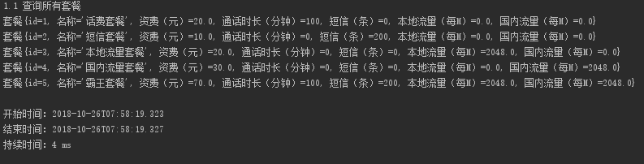
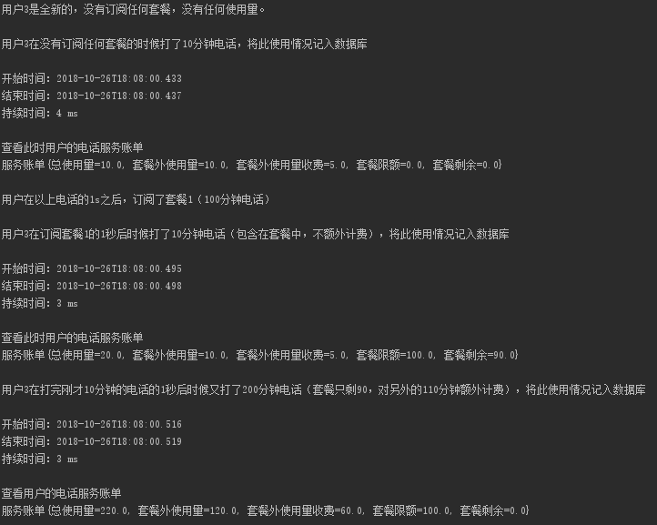
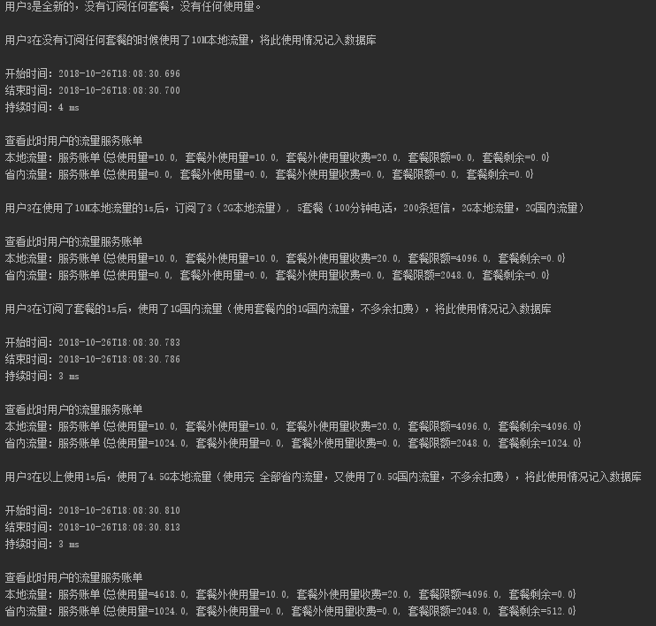
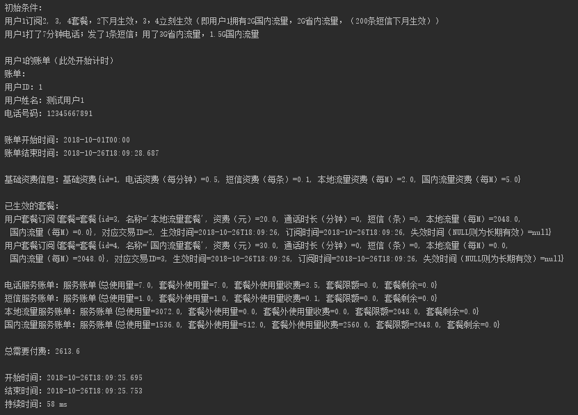

# 说明文档

By 161250010 陈俊达

<!-- TOC -->

- [说明文档](#说明文档)
- [1. 环境说明](#1-环境说明)
    - [1.1 环境说明](#11-环境说明)
    - [1.2 数据库环境说明](#12-数据库环境说明)
- [2. 数据库表设计和ER图](#2-数据库表设计和er图)
    - [2.1 ER图](#21-er图)
    - [2.2 各个表的含义](#22-各个表的含义)
    - [2.3 各个表列的含义](#23-各个表列的含义)
- [3. ！！设计说明和算法：惰性资费生成](#3-设计说明和算法惰性资费生成)
- [4. ！！已有数据说明](#4-已有数据说明)
- [5. 操作](#5-操作)
    - [5.1 对某个用户进行套餐的查询（包括历史记录）](#51-对某个用户进行套餐的查询包括历史记录)
        - [5.1.1 查询所有套餐](#511-查询所有套餐)
        - [5.1.2 查询用户目前有效的套餐。](#512-查询用户目前有效的套餐)
        - [5.1.3 查询用户订阅过的所有套餐](#513-查询用户订阅过的所有套餐)
        - [5.1.4 查询用户套餐的交易记录](#514-查询用户套餐的交易记录)
    - [5.2 订购套餐](#52-订购套餐)
    - [5.3 退订套餐](#53-退订套餐)
    - [5.4 某个用户在通话情况下的资费生成](#54-某个用户在通话情况下的资费生成)
    - [5.5 某个用户在使用流量情况下的资费生成](#55-某个用户在使用流量情况下的资费生成)
    - [5.6 某个用户月账单的生成](#56-某个用户月账单的生成)
- [6. 已知问题和可用优化方案](#6-已知问题和可用优化方案)
- [7. 其他](#7-其他)

<!-- /TOC -->


# 1. 环境说明

## 1.1 环境说明

| 环境 | 版本号 |
| -- | -- |
| 编程语言 | Java 8 |
| 持久层框架 | MyBatis 3.4.6 |
| 数据库 | MySQL 5.7 |
| 操作系统 | Windows 10 17763 x64 |
| IDE | Intellij IDEA |


## 1.2 数据库环境说明

| 项 | 值 | 
| -- | -- | 
| 数据库环境和版本 | MySQL 5.7 | 
| 编码 | UTF-8 |
| Driver | mysql-connector-java 5.1.46 |
| 地址 | localhost:3306 |
| 数据库名（schema名）| carrier | 
| 用户名 | root | 
| 密码 | zhanglingzhe0820 |

数据库密码中出现了另一个同学的名字，是因为本机的MySQL是大二下软工2的时候设置的，当时为了减少配置的麻烦，就约定了在每个人的电脑上都使用相同的用户名和密码。

# 2. 数据库表设计和ER图

## 2.1 ER图

By processOn


## 2.2 各个表的含义

| 表 | 表名 | 含义 |
| -- | -- | -- |
| 用户 | user | 保存用户信息 |
| 基础资费 | basiccost | 保存可用的基础资费。一个用户必定有一个基础资费 |
| 套餐 | plan | 保存可用的套餐 |
| 订阅 | userplansubscription | 保存用户订阅的套餐情况。用户订阅一个套餐，会在订阅里增加一条记录；每次退订会设置对应的订阅的失效时间。 |
| 交易记录 | userplantransaction | 保存用户的交易信息。每次订阅、退订都会在交易记录里增加一条记录，保存用户ID、套餐ID、交易时间和交易行为（立即订阅，立即退订，下月订阅，下月退订） |
| 使用情况 | usage | 保存用户对电话、短信和流量的使用情况。所有使用情况均保存在这一个表中。 |

## 2.3 各个表列的含义

表：用户 (user)

| 列 | 类型 | 含义 |
| -- | -- | -- |
| id | int primary key auto_increment | ID |
| name | varchar(30) | 用户的姓名 |
| phoneNumber  | varchar(15) | 用户的手机号 |
| basicCostId | int | 此用户所采用的基础资费的ID |

表：基础资费 (basiccost)

| 列 | 类型 | 含义 |
| -- | -- | -- |
| id | int primary key auto_increment | ID |
| callCost | decimal(11, 3) | 电话资费，按分钟计。采用decimal(11, 3)而不是float是为了精确计算，下同。 |
| smsCost | decimal(11, 3) | 短信资费 | 
| localDataCost | decimal(11, 3) | 本地流量资费 |
| domesticDataCost | decimal(11, 3) | 国内流量资费 |

表：套餐 (plan)

| 列 | 类型 | 含义 |
| -- | -- | -- |
| id | int primary key auto_increment | ID |
| name | varchar(20) | 套餐名字 |
| cost | decimal(11, 3) | 套餐资费 |
| callMinutes | int | 电话时长 |
| sms | int | 短信量 |
| localData | float | 本地流量 |
| domesticData | float | 国内流量 |

表：订阅 (userplansubscription)

| 列 | 类型 | 含义 |
| -- | -- | -- |
| transactionId | int primary key | 该订阅所对应的交易ID。由于交易ID唯一，且只有在退订的时候需要通过交易ID精确查询，所以用交易ID作为主键非常合适 |
| userId | int | 用户ID |
| planId | int | 套餐ID |
| activateTime | datetime | 生效时间。从此时间开始（含）套餐订阅即生效。 |
| orderTime | datetime | 订阅日期，即订阅成功时的时间 |
| deactivateTime | datetime | 失效时间。从此时间开始（含）套餐订阅即失效。 |

表：交易记录 (userplantransaction)

| 列 | 类型 | 含义 |
| -- | -- | -- |
| transactionId | int primary key auto_increment | 交易ID |
| userId | int | 该交易的用户ID |
| planId | int | 相关套餐ID |
| time | datetime | 交易时间 |
| action | enum('ORDER_IMMEDIATELY','ORDER_NEXT_MONTH', 'CANCEL_IMMEIDATELY', 'CANCEL_NEXT_MONTH') | 交易行为：“立即生效”、“下月生效”、“立即取消”、“下月取消”。 |

表：使用情况 (usage)

| 列 | 类型 | 含义 |
| -- | -- | -- |
| userId | int | 用户ID |
| amount | float | 用量 |
| startTime | datetime | 发生开始时间。扣除套餐额度和计费以此时间为准。 |
| serviceType | enum('CALL', 'SMS', 'LOCAL_DATA', 'DOMESTIC_DATA') | 服务类型。分为：电话，短信，本地流量，国内流量 |

# 3. ！！设计说明和算法：惰性资费生成

为了满足**同时支持立刻取消和下月取消套餐（而不是现实中只允许次月取消）**这一需求，在本设计中，每一次话费、短信和流量使用（通常为服务使用）时，只记录其使用时间和使用量，**不产生本次使用所产生的费用**，因为本次使用产生的费用可能会因为用户后来立即取消套餐而发生改变。

在账单生成的时候（只支持计算月度账单），会获取用户的套餐订阅情况和使用情况，通过以下算法动态算出用户对某服务（话费、短信和流量）的使用情况（限额，超出量，总使用量，额外付费，一起称为服务账单）。相关代码位于`database.data.MainDataService.getBillUsageByServiceType(ServiceType serviceType, int userId, LocalDateTime endDate, List<UserPlan> activePlans, double basicCost)`

对话费、短信：

```java

// activatePlans：List<Plan>，为产生账单日期为止生效的套餐集合
// usages：List<Usage>，为本月产生的本服务类型（电话、短信或流量）使用量集合

// 计算所有目前激活的套餐的限额量。
double limit = activePlans.stream().mapToDouble(x -> x.getPlan().getLimitByServiceType(serviceType)).sum();

// 初始化 目前剩余限额量，超出量，总使用量
double remaining = 0;
double extra = 0;
double totalUsed = 0;

int planIndex = 0;
// 对每一个使用情况
for (Usage u : usages) {
    // 将 在此使用情况前就生效了的 且 还没有加入目前剩余限额量 的套餐所包含的限额加入 目前剩余限额量。
    // 此是为了避免在在某次使用服务之后订阅的订单的限额用于那次服务本身的情况。
    while (planIndex < activePlans.size() && activePlans.get(planIndex).isActivatedAt(u.getStartTime())) {
        UserPlan plan = activePlans.get(planIndex);
        remaining += plan.getPlan().getLimitByServiceType(serviceType);
        planIndex++;
    }
    // 获得此使用情况的使用量
    double amount = u.getAmount();

    //增加总使用量
    totalUsed += amount;

    if (amount > remaining) {
        // 如果此使用情况的使用量 大于 目前剩余限额量
        // 增加超出的是使用量至超出量
        extra += amount - remaining;
        // 清空剩余量
        remaining = 0;
    } else {
        // 如果此使用情况的使用量 小于或等于 目前剩余限额量
        // 目前剩余限额量
        remaining -= amount;
    }
}

// 计算超出计费
double charge = extra * basicCost;
return new ServiceBill(totalUsed, extra, charge, limit, remaining);
```

对流量（本地或国内流量）：

```java
// 由于本地流量有可能会使用国内流量的限额，所以无论是本地还是国内流量，都得同时计算两种流量的使用情况。

// activatePlans：List<Plan>，为产生账单日期为止生效的套餐集合
// usages：List<Usage>，为本月产生的所以流量使用量（包括本地和国内）集合

// 像话费和短信一样，初始化 目前剩余限额量，超出量，总使用量
double localDataRemaining = 0;
double domesticDataRemaining = 0;

double localDataLimit = activePlans.stream().mapToDouble(x -> x.getPlan().getLocalData()).sum();
double domesticDataLimit = activePlans.stream().mapToDouble(x -> x.getPlan().getDomesticData()).sum();

double localDataExtra = 0;
double domesticDataExtra = 0;

double localDataTotal = 0;
double domesticDataTotal = 0;

int planIndex = 0;
for (Usage u : usages) {
    // 将 在此使用情况前就生效了的 且 还没有加入目前剩余限额量 的套餐所包含的限额加入 目前剩余限额量
    while (planIndex < activePlans.size() && activePlans.get(planIndex).isActivatedAt(u.getStartTime())) {
        UserPlan plan = activePlans.get(planIndex);

        localDataRemaining += plan.getPlan().getLocalData();

        domesticDataRemaining += plan.getPlan().getDomesticData();
        planIndex++;
    }

    double amount = u.getAmount();

    // 分这个usage是本地还是国内流量
    if (u.getServiceType().equals(ServiceType.LOCAL_DATA)) {
        localDataTotal += amount;
        // 这个usage是本地流量，先检测localDataLimit是否够用
        if (amount > localDataRemaining) {
            // localDataLimit不够用，先扣除所有localDataLimit，再检测domesticDataLimit是否够用
            double extraAmount = amount - localDataRemaining;
            localDataRemaining = 0;
            if (extraAmount > domesticDataRemaining) {
                // domesticDataLimit也不够用。将多余的流量加到localDataExtra中，扣除所有的domesticDataLimit。
                localDataExtra += extraAmount - domesticDataRemaining;
                domesticDataRemaining = 0;
            } else {
                // domesticData够用，去除响应的domesticDataLimit
                domesticDataRemaining -= extraAmount;
            }
        } else {
            // localData够用。只去除localDataLimit
            localDataRemaining -= amount;
        }
    } else {
        domesticDataTotal += amount;
        // 这个usage是国内流量。直接检测domesticDataLimit是否够用。
        if (amount > domesticDataRemaining) {
            // 国内流量限额不够用。将多余的流量加到domesticDataExtra中，扣除所有的domesticDataLimit，
            domesticDataExtra += amount - domesticDataRemaining;
            domesticDataRemaining = 0;
        } else {
            // 国内流量够用。去除domesticDataLimit
            domesticDataRemaining -= amount;
        }
    }
}

// 根据要求的服务账单类型返回不同的数据
if (serviceType.equals(ServiceType.LOCAL_DATA)) {
    return new ServiceBill(localDataTotal, localDataExtra, localDataExtra * basicCost, localDataLimit, localRemaining);
} else {
    return new ServiceBill(domesticDataTotal, domesticDataExtra, domesticDataExtra * basicCost, domesticDataLimit, domesticRemaining);
}
```

# 4. ！！已有数据说明

`数据脚本.sql`里包含此数据的初始数据（通过mysqldump导出，未测试，有可能有编码问题）。

调用项目里`database.example.InitExample.insertInitData()`静态方法也可以做到清空原有数据库，重新建立表和插入初始数据这系列操作。

提交的代码中，Main方法和MainTest测试用例套件会自动重置数据库并插入默认数据。

已有数据说明如下：

1. 一共有5种套餐，ID分别为1-5，其分别为：
    1. 话费套餐，月资费20，包含100分钟电话
    2. 短信套餐，月资费10，包含200条短信
    3. 本地流量套餐，月自资费20，包含2048M本地流量
    4. 国内流量套餐，月资费30，包含2048M国内流量
    5. 霸王套餐，月资费70，包含100分钟电话，200条短信，2048M本地流量，2048M国内流量
2. 一共有1种基础资费，其标准为电话资费0.5元/分钟，短信资费0.1元/条，本地流量2元/M，国内流量5元/M。
3. 初始化3个用户，ID分别为1, 2, 3，都使用上述基础资费，订阅套餐的情况如下：
    1. 用户1订阅2, 3, 4套餐，2下月生效，3, 4立刻生效
    2. 用户2订阅1, 5套餐，均立刻生效；但是在1s后立即退订了1套餐
    3. 用户3什么都没有订阅
4. 用户1在订阅套餐后，使用了7分钟的电话，1条短信，3G本地流量和1.5G国内流量（国内流量在3G本地流量之后使用）。
5. 对应的用户套餐信息记录和用户套餐交易记录也同时生成。

注意，用户1的使用情况是在订阅完套餐后2s内做出的（电话、短信和本地流量是在1s内完成的，国内流量是在第2s完成的），在初始化结束后，需要等待2s再产生账单，或者使用带时间的重载版本产生2s后的账单。

# 5. 操作

## 5.1 对某个用户进行套餐的查询（包括历史记录）

此题目有歧义，以下分别为**查询所有套餐**、**查询用户目前所有生效的套餐**、**查询用户订阅过的所有套餐**和**查询用户套餐的交易记录**操作的说明。

### 5.1.1 查询所有套餐

方法：`Main::queryAllPlans()`

设计：直接查询plan表里的所有数据。

涉及到的SQL：
```sql
select * from plan;
```

截图和时间：



### 5.1.2 查询用户目前有效的套餐。

方法：`Main::queryActivePlans()`

设计：查询用户套餐订阅信息，根据activateTime和deactivateTime筛选目前生效的套餐，并和套餐进行外连接。

涉及到的SQL：

```sql
set @time = #{datetime};
select plan.*, userplansubscription.* from plan, userplansubscription
where userplansubscription.userId = #{userId} and plan.id = userplansubscription.planId and (@time >= userplansubscription.activateTime and (ISNULL(userplansubscription.deactivateTime) or userplansubscription.deactivateTime > @time))
order by userplansubscription.activateTime;
```

操作截图和时间：


### 5.1.3 查询用户订阅过的所有套餐

方法：`Main::queryUserPlanSubscriptions()`

设计：查询用户套餐订阅信息，并和套餐进行外连接，拿到套餐和套餐订阅信息。

涉及到的SQL:

```sql
select plan.*, userplansubscription.* from plan, userplansubscription
where userplansubscription.userId = #{userId} and plan.id = userplansubscription.planId
order by userplansubscription.orderTime;
```

操作截图和时间：


### 5.1.4 查询用户套餐的交易记录

方法：`Main::queryTransactions()`

设计：通过userId查询userplantransaction表里的内容。

涉及到的SQL：

```sql
select * from userplantransaction
where userId=#{userId};
```

操作截图和时间：


## 5.2 订购套餐

方法：`Main::orderPlan()`

设计：首先在交易表里的插入此次交易的信息（UserPlanTransaction），然后往用户套餐记录里插入用户对此套餐的订阅信息（UserPlanSubscription），并根据*是否立刻生效(activateImmediately)*的选择设置不同的**交易操作(action)**和**用户订阅信息（UserPlanSubscription）里的生效时间(activateTime)**。最后还要返回此次交易记录的ID用于以后的退订。

涉及到的SQL：

```sql
set @now = #{datetime};

insert into userplantransaction(userId, planId, time, action)
values (#{userId}, #{planId}, @now,
<choose>
    <when test="activateImmediately">
        'ORDER_IMMEDIATELY'
    </when>
    <otherwise>
        'ORDER_NEXT_MONTH'
    </otherwise>
</choose>
);

set @transactionId = last_insert_id();

insert into userplansubscription(transactionId, userId, planId, activateTime, orderTime)
values (@transactionId, #{userId}, #{planId},
<choose>
    <when test="activateImmediately">
        @now
    </when>
    <otherwise>
        adddate(last_day(@now), 1)
    </otherwise>
</choose>
,
@now);


select @transactionId;
```

操作截图和时间：


## 5.3 退订套餐

方法：`Main::cancelPlan()`

设计：首先在交易表里的插入此次交易的信息（UserPlanTransaction），然后通过参数交易ID (transactionId) 在用户订阅记录里找到用户需要退订的套餐的订阅记录，之后根据参数*是否立即生效(activateImmediately)*修改此退订的订阅记录的失效时间(deactivateTime)。若为立即生效，即设为当前时间；若为以后生效，则为下月第一天的第一秒。

涉及到的SQL：

```sql
set @now = #{datetime};

select userId, planId into @userId, @id from userplantransaction
where transactionId=#{transactionId};

insert into userplantransaction(userId, planId, time, action)
values (@userId, @id, @now,
<choose>
    <when test="activateImmediately">
        'CANCEL_IMMEDIATELY'
    </when>
    <otherwise>
        'CANCEL_NEXT_MONTH'
    </otherwise>
</choose>
);

update userplansubscription set deactivateTime =
<choose>
    <when test="activateImmediately">
        @now
    </when>
    <otherwise>
        adddate(last_day(@now), 1)
    </otherwise>
</choose>
where transactionId=#{transactionId};
```

操作截图和时间：


## 5.4 某个用户在通话情况下的资费生成

由于本系统采用**惰性生成资费**的策略（[3. 设计说明和算法：惰性资费生成](#3-设计说明和算法惰性资费生成)），所以在使用时不会产生资费。在示例中，采用在产生前产生总账单和产生资费后产生总账单的策略来模拟此情况。

方法：`Main::addCallUsage()`

设计：直接往使用情况表中插入此使用情况。

涉及到的SQL：

```sql
insert into `usage`(userId, amount, startTime, serviceType) values (#{userId}, #{amount}, #{startTime}, #{serviceType});
```

操作截图和时间：



## 5.5 某个用户在使用流量情况下的资费生成

由于本系统采用**惰性生成资费**的策略（[3. 设计说明和算法：惰性资费生成](#3-设计说明和算法惰性资费生成)），所以在使用时不会产生资费。在示例中，采用在产生前产生总账单和产生资费后产生总账单的策略来模拟此情况。

方法：`Main::addDataUsage()`

设计：直接往使用情况表中插入此使用情况。


涉及到的SQL：

```sql
insert into `usage`(userId, amount, startTime, serviceType) values (#{userId}, #{amount}, #{startTime}, #{serviceType});
```

操作截图和时间：




## 5.6 某个用户月账单的生成

采用已有数据（[4. 已有数据说明](#4-已有数据说明)），计算3s后用户1的订单。

方法：`Main::generateBill()`

设计：采用[惰性资费生成](#3-设计说明和算法惰性资费生成)算法计算用户1的账单。

操作时间和截图:



# 6. 已知问题和可用优化方案

1. 问题：为了代码的简化，我将**所有用户的所有类型的使用情况**都放在了同一个使用情况表中。随着使用量的增加，这个表的规模将会指数型膨胀，增加和查询这个表的内容的效率将会极大地降低。
    - 可选优化方案1：访问此表一般是用于产生用户账单，产生用户账单时需要根据用户ID和服务类型进行查询，即此表一般是通过userId和serviceType列来进行查询。由于serviceType列选择性较低（仅4个不同取值）可以选择在此表的userId列上建立索引，这样能加快查询速率。
    - 可选优化方案2：由于查询本表时，只会同时查询“通话”、“短信”和“流量类型”的使用记录。所以，将表按“通话”、“短信”、“流量”分为3个表，再给每个表上的userId建立索引，这样能极大增加查询和增加的效率。

2. 问题：账单和套餐使用量、剩余量等数据都是及时计算的，每个查询都需要存取所有表中用户相关的所有信息，当数据量大的时候，表的连接会影响性能。
    - 可选优化方案1：在各个表上做缓存，这样能节省查询数据的时间
    - 可选优化方案2：在应用层做缓存，这样能直接省去很多查询数据的时间。

# 7. 其他

1. 由于程序简单，数据量少，本程序的所有方法的运行速度极快，通常在几毫秒中就能够完成一个操作，所以数据库的缓存有时会造成数据不一致的现象。举例，在订购一个套餐后立即查询账单数据，可能会发现账单并没有包含这个套餐。为了避免这个情况，本程序做了一下的尝试：
    - 在MyBatis设置文件里关闭了缓存`<setting name="cacheEnabled" value="false"/>`
    - 所有时间的操作均由java代码传给SQL（而不是在SQL中调用curdate()或者now()来获得当前时间）
    - 在数据库服务实现类`data.MainDataService`中，有的方法提供了带有时间参数的重载版本（不带时间参数的重载版本均为使用当前时间）
当你发现数据和本文档中给出的示例不同，请先检查时间是否正确设置和传入。

2. 为了测试，本程序通过JUnit框架写了一些测试用例（MainTest），其中包含一些非常特殊的测试场景。若感兴趣，请在`database.test`包里自己查看代码，运行并查看结果。
