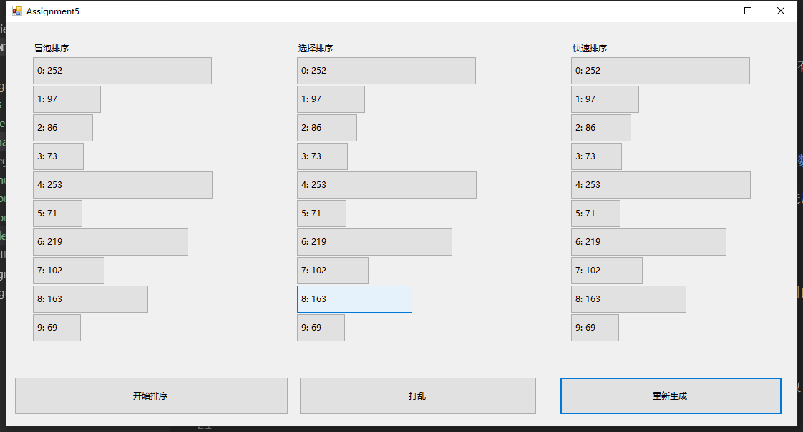
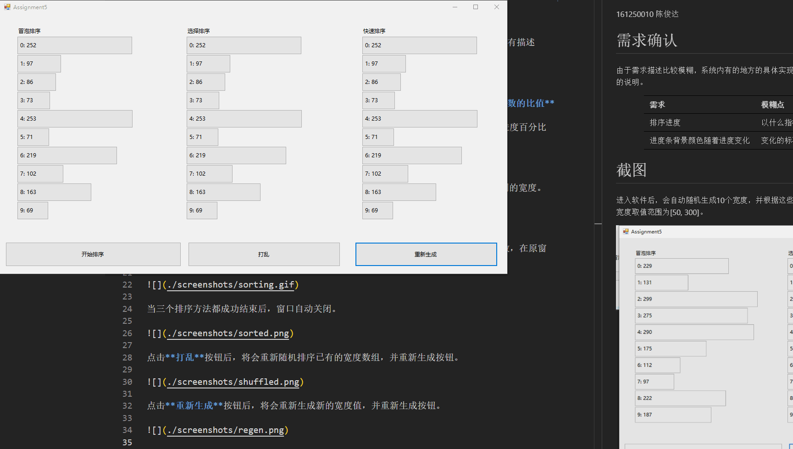
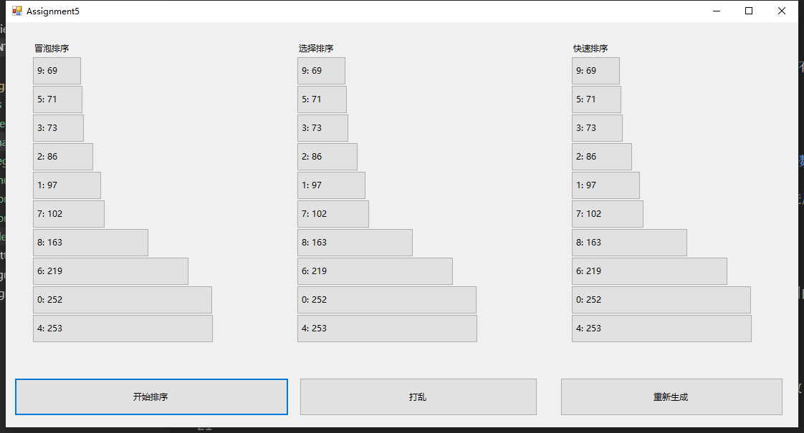
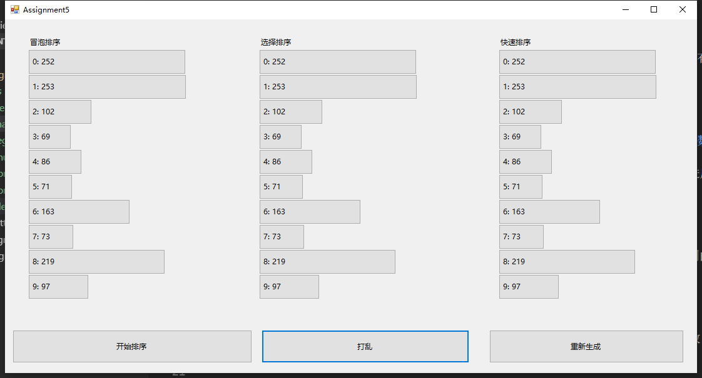
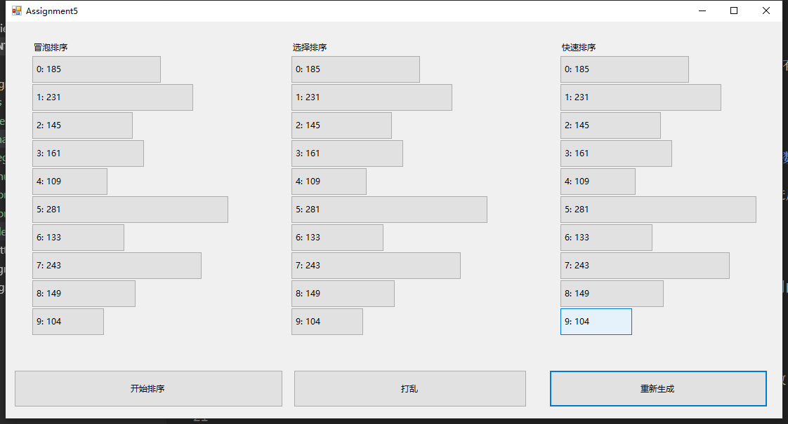

# .NET作业5

161250010 陈俊达

# 需求确认

由于需求描述比较模糊，系统内有的地方的具体实现依赖我的个人想法。以下为需求中没有描述的、但是对系统功能有密切关系的几个点的说明。

| 需求 | 模糊点 | 实现 |
| --- | -- | -- |
| 排序进度 | 以什么指标表示排序的进度 | 以**目前交换元素的次数**和**总交换次数的比值**作为进度 |
| 进度条背景颜色随着进度变化 | 变化的标准 | 进度条背景颜色的RGB值为(0, 目前进度百分比*255, 0) |

# 截图

进入软件后，会自动随机生成10个宽度，并根据这些宽度生成3组按钮。3组按钮均有相同的宽度。按钮上的文字表示按钮的序号和宽度。宽度取值范围为[50, 300]。



点击**开始排序**后，将弹出新窗口，在窗口中显示排序进度、已交换次数和总交换次数，在原窗口中，被交换的按钮也会交换位置。



当三个排序方法都成功结束后，窗口自动关闭。



点击**打乱**按钮后，将会重新随机排序已有的宽度数组，并重新生成按钮。



点击**重新生成**按钮后，将会重新生成新的宽度值，并重新生成按钮。



# 运行说明

1. 使用Visual Studio 2017打开本项目
2. 运行！

# 实现说明

## 生成按钮和重新生成按钮

生成按钮分为以下两个步骤

1. 获得一组10个随机宽度

```csharp
private List<int> GetRandomWidths(int num)
{
    int min = 50, max = 300;
    return Enumerable.Range(0, num).Select(x => random.Next(min, max)).ToList();
}
```

2. 根据宽度生成三组按钮。在生成后，进行定位

```c#

private const int HEIGHT = 40;

// 以主界面上三个Label的位置作为锚点(anchor)，为按钮进行定位
private Label[] labelAnchors = new Label[] { lbBubble, lbSelection, lbQuick };

// 传入生成的宽度数组
private void CreateButtons(List<int> widths)
{
    // 生成三组
    for (int col = 0; col < 3; col++)
    {
        var btns = new List<Button>();

        for (int index = 0; index < 10; index++)
        {
            btns.Add(CreateButton(widths[index], col, index));
        }
        LocateButtons(btns, col);
        Controls.AddRange(btns.ToArray());
        buttons.Add(btns);
    }
}

// 定位按钮
private void LocateButtons(List<Button> buttons, int column)
{
    // 获得列对应锚点的位置
    var anchor = labelAnchors[column].Location;

    for (int i=0;i<buttons.Count;i++)
    {
        // 计算按钮位置，X坐标和锚点相同，Y坐标为(锚点Y坐标 +20 + 按钮高度 * 按钮的序号)
        buttons[i].Location = new Point(anchor.X, anchor.Y + 20 + HEIGHT * i);
    }

}
```

## 打乱按钮

打乱按钮即首先把按钮的宽度数组打乱（使用`OrderBy(x => random.Next())`），然后根据新的数组，按上述方式重新生成按钮。

```csharp
private void btnShuffle_Click(object sender, EventArgs e)
{
    var widths = buttons.First().Select(x => x.Width).OrderBy(x => random.Next()).ToList();
    RemoveAllButtons();
    CreateButtons(widths);
}
```

## 交换两个按钮的位置

交换两个按钮的位置，即是将两个按钮的Location的值进行互换即可，在进行排序时，本方法将会提供给排序算法。

```cs
private void SwapButtons(Button btn1, Button btn2)
{
    var temp = btn1.Location;
    btn1.Location = btn2.Location;
    btn2.Location = temp;
    Update();
}
```

## 交换行为设计

为了增加代码重用，系统提供了Sort类。每个排序算法均应该继承Sort类，并实现DoSort方法。排序算法**对一个int数组进行排序**，并调用传入的**swap**方法交换数组内两个元素。（而不是自己去做交换！）

例如，如下为选择排序的实现方法。


Sorting\SelectionSort.cs

```cs

public delegate void Swap(int i, int j);

public class SelectionSort : Sort
{
    public SelectionSort(List<Button> buttons) : base(buttons){ }

    protected override void DoSort(List<int> widths, Swap swap)
    {
        int len = widths.Count;
        for (int i = 0; i < len - 1; i++)
        {
            int min = i;
            for (int j = i + 1; j < len; j++)
            {
                if (widths[min] > widths[j])
                {
                    min = j;
                }

            }
            swap(min, i);
        }
    }
}
```

这样设计保证了可以**在运行时动态替换交换方法**的实现，这个功能是实现进度条的基础。

为了实现显示排序进度，软件需要在真正对按钮进行排序之前，进行一次**模拟排序**，获得交换操作需要进行的次数。

由于可以在运行时动态替换交换方法，所以在模拟排序的时候，**提供模拟排序的交换方法**，就可以计算出本次排序的总交换次数。

```cs
public int StepCount
{
    get
    {
        // 初始化计数器
        int count = 0;

        // 获得按钮宽度数组
        List<int> widths = GetWidthsList();

        // 进行排序，传入模拟排序对应的交换方法
        DoSort(widths, (i, j) =>
        {
            // 首先给计数器+1
            count++;

            // 再进行真正的数组元素的交换
            widths.Swap(i, j);
        });

        return count;
    }
}
```

而在真正进行排序的时候，提供**真正交换按钮的交换方法**，这样就可以交换


```cs
public void SortButtons()
{
    // 获得按钮宽度数组
    var widths = GetWidthsList();

    // 传入按钮宽度数组，进行排序
    DoSort(widths, (i, j) =>
    {
        // 交换i, j两个按钮。
        // Swap方法为ProgressesForm窗体提供的方法（请看下一节），
        Swap(i, j);

        // 交换Buttons数组的索引为i, j的两个元素
        // Buttons数组即为之前产生的一列Button
        Buttons.Swap(i, j);

        // 交换widths数组的索引为i, j的两个元素
        widths.Swap(i, j);
    });
}
```

## 进度条窗口多线程

主窗口点击开始排序后，将会显示进度条窗口（ProgressesForm.cs）。进度条窗口在加载时，会生成3个进程，分别对应3种排序方法。

ProgressesForm.cs

```cs
private void ProgressesForm_Load(object sender, EventArgs e)
{
    // Start threads

    var bubbleThread = new Thread(() =>
    {
        Run(new BubbleSort(buttons[0]), pbBubble, lbBubble);

    });

    var selectionThread = new Thread(() =>
    {
        Run(new SelectionSort(buttons[1]), pbSelection, lbSelection);
    });

    var quickThread = new Thread(() =>
    {
        Run(new QuickSort(buttons[2]), pbQuick, lbQuick);
    });

    bubbleThread.Start();
    selectionThread.Start();
    quickThread.Start();
    
}
```

在Run方法中，将会传入Swap方法。

在方法中，会调用由主窗口提供的SwapButtons方法，以在UI上交换两个按钮的位置。

交换后，还会计算目前进度，并显示在UI上。

由于WinForm只能在UI线程上更新UI，所以这里这些对UI的操作需要调用`Invoke`方法，以在UI线程上执行这些UI更新操作。

```cs

int count = 0;

sort.Swap = (i, j) =>
{
    count++;

    // 委托UI线程更新UI
    Invoke(new Action(() =>
    {
        // swap即为主窗口提供的SwapButtons方法
        swap(sort.Buttons[i], sort.Buttons[j]);

        // 计算进度并显示
        double percent = (double)count / stepCount * 100;
        pb.Value = (int)percent;
        pb.BackColor = GetProgressBarBackgroundColor(percent);
        lb.Text = $"{count}/{stepCount} {percent.ToString("0.##")}%";
    }));

    // 暂停本线程300ms，以显示进度
    Thread.Sleep(300);

};

// 开始排序
sort.SortButtons();
```

在每个排序算法结束后，将会**互斥地**增加ProgressesForm的`completedCount`计数器（使用`Interlocked.Increment`）。这个计数器用于统计目前完成的排序算法个数。当所有排序算法都结束时（即`completedCount == 3`），将会关闭ProgressesForm窗口。

```cs
int result = Interlocked.Increment(ref completedCount);
if (result == 3)
{
    Thread.Sleep(500);
    Invoke(new Action(() =>
    {
        Close();
    }));
}
```

## 进度条修改颜色

原生的ProgressBar组件不支持修改颜色，于是只能通过继承ProgressBar造一个支持变更颜色的进度条组件。以下组件能够根据被设定的BackColor属性绘制对应颜色的进度条。

NewProgressBar.cs

```cs
public class NewProgressBar : ProgressBar
{
    public NewProgressBar()
    {
        this.SetStyle(ControlStyles.UserPaint, true);
    }

    protected override void OnPaint(PaintEventArgs e)
    {
        Rectangle rec = e.ClipRectangle;

        rec.Width = (int)(rec.Width * ((double)Value / Maximum)) - 4;
        if (ProgressBarRenderer.IsSupported)
        {
            ProgressBarRenderer.DrawHorizontalBar(e.Graphics, e.ClipRectangle);
        }
        //rec.Height = rec.Height - 4;
        e.Graphics.FillRectangle(new SolidBrush(BackColor), 2, 2, rec.Width, rec.Height);
    }
}
```